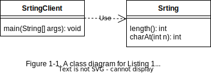
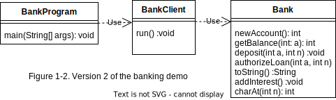
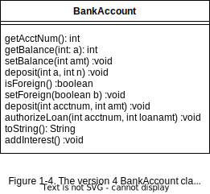
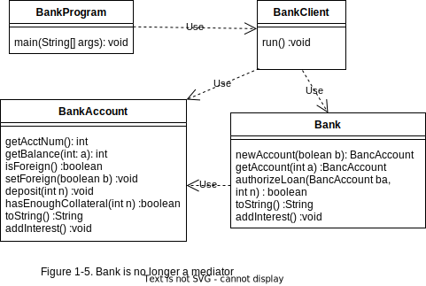

# Program Design: Principles, Polymorphism, and Patterns

## Modular Software Design

> The Fundamental Principle of Software Design
> 
>A program should be designed so that any change to it will affect only a small, predictable portion of the code.

### Object-Oriented Basics

Each object belongs to a class, which defines the object’s capabilities in terms of its public variables and methods.

#### APIs and Dependencies

The public variables and methods of a class are called its Application
Program Interface (or API).

Suppose the code for a class X holds an object of class Y and uses it to
call one of Y’s methods. Then X is called a client of Y.

```java
// Listing 1-2
public class StringClient {
    public static void main(String[] args) {
    String s = "abc";
    System.out.println(s.length());
}
}
```

A class’s API is a contract between the class and its clients. The code
for StringClient implies that the class String must have a method
length that satisfies its documented behavior. However, the StringClient
code has no idea of or control over how String computes that length.

If X is a client of Y then Y is said to be a dependency of X. The idea is that
X depends on Y to not change the behavior of its methods. If the API for
class Y does change then the code for X may need to be changed as well.

#### Modularity

Treating an API as a contract simplifies the way that large programs get
written. A large program is organized into multiple classes. Each class is
implemented independently of the other classes, under the assumption that each method it calls will eventually be implemented and do what it
is expected to do. When all classes are written and debugged, they can be
combined to create the final program. We say that such programs are modular

#### Class Diagrams



#### Static vs. Nonstatic

A static variable is a variable that “belongs” to a class. It is shared among
all objects of the class. If one object changes the value of a static variable
then all objects see that change. On the other hand, a nonstatic variable
“belongs” to an object of the class

Methods can also be static or nonstatic. A static method is not associated with an object. A client can call a static
method by using the class name as a prefix. Alternatively, it can call a static
method the conventional way, prefixed by a variable of that class.

```java
// Listing 1-4. Version 1 of the Banking Demo

public class BankProgram {
    private HashMap<Integer,Integer> accounts
    = new HashMap<>();
    private double rate = 0.01;
    private int nextacct = 0;
    private int current = -1;
    private Scanner scanner;
    private boolean done = false;
    public static void main(String[] args) {
        BankProgram program = new BankProgram();
        program.run();
    }
    public void run() {
        scanner = new Scanner(System.in);
        while (!done) {
            System.out.print("Enter command (0=quit, 1=new,
            2=select, 3=deposit, 4=loan,
            5=show, 6=interest): ");
            int cmd = scanner.nextInt();
            processCommand(cmd);
        }
        scanner.close();
    }
    private void processCommand(int cmd) {
        if (cmd == 0) quit();
        else if (cmd == 1) newAccount();
        else if (cmd == 2) select();
        else if (cmd == 3) deposit();
        else if (cmd == 4) authorizeLoan();
        else if (cmd == 5) showAll();
        else if (cmd == 6) addInterest();
        else
            System.out.println("illegal command");
        }
    
    private void quit() {
        done = true;
        System.out.println("Goodbye!");
    }

    private void newAccount() {
        current = nextacct++;
        accounts.put(current, 0);
        System.out.println("Your new account number is "
        + current);
    }

12
    private void select() {
        System.out.print("Enter account#: ");
        current = scanner.nextInt();
        int balance = accounts.get(current);
        System.out.println("The balance of account " + current
          + " is " + balance);
    }

    private void deposit() {
        System.out.print("Enter deposit amount: ");
        int amt = scanner.nextInt();
        int balance = accounts.get(current);
        accounts.put(current, balance+amt);
    }

    private void authorizeLoan() {
        System.out.print("Enter loan amount: ");
        int loanamt = scanner.nextInt();
        int balance = accounts.get(current);
        if (balance >= loanamt / 2)
          System.out.println("Your loan is approved");
        else
          System.out.println("Your loan is denied");
    }

    private void showAll() {
        Set<Integer> accts = accounts.keySet();
        System.out.println("The bank has " + accts.size()
          + " accounts.");
        for (int i : accts)
          System.out.println("\tBank account " + i
          + ": balance=" + accounts.get(i));
    }    

    private void addInterest() {
        Set<Integer> accts = accounts.keySet();
        for (int i : accts) {
          int balance = accounts.get(i);
          int newbalance = (int) (balance * (1 + rate));
          accounts.put(i, newbalance);
        }
    }
}
```

### The Single Responsibility Rule

> The Single Responsibility Rule
>
> A class should have a single purpose, and
all its methods should be related to that purpose.




```java
Listing 1-5. The Version 2 Bank Class
public class Bank {
    private HashMap<Integer,Integer> accounts
    = new HashMap<>();
    private double rate = 0.01;
    private int nextacct = 0;

    public int newAccount() {
      int acctnum = n}extacct++;
        accounts.put(acctnum, 0);
        return acctnum;
    }

    public int getBalance(int acctnum) {
        return accounts.get(acctnum);
    }

    public void deposit(int acctnum, int amt) {
        int balance = accounts.get(acctnum);
        accounts.put(acctnum, balance+amt);
    }

      public boolean authorizeLoan(int acctnum, int loanamt) {
        int balance = accounts.get(acctnum);
        return balance >= loanamt / 2;
    }

    public String toString() {
        Set<Integer> accts = accounts.keySet();
        String result = "The bank has " + accts.size()
          + " accounts.";
        for (int i : accts)
          result += "\n\tBank account " + i
            + ": balance=" + accounts.get(i);
        return result;
    }
    
    public void addInterest() {
      Set<Integer> accts = accounts.keySet();
      for (int i : accts) {
        int balance = accounts.get(i);
        int newbalance = (int) (balance * (1 + rate));
        accounts.put(i, newbalance);
      }
    }
}

// Listing 1-6. The Version 2 BankClient Class
public class BankClient {
    private int current = -1;
    private Scanner scanner = new Scanner(System.in);
    private boolean done = false;
    private Bank bank = new Bank();
    
    public void run() {
    ... // unchanged from version 1
    }

    private void processCommand(int cmd) {
    ... // unchanged from version 1
    }

    private void quit() {
    ... // unchanged from version 1
    }

    private void newAccount() {
        current = bank.newAccount();
        System.out.println("Your new account number is "
          + current);
    }

    private void select() {
        System.out.print("Enter acct#: ");
        current = scanner.nextInt();
        int balance = bank.getBalance(current);
        System.out.println("The balance of account "
            + current + " is " + balance);
    }

    private void deposit() {
        System.out.print("Enter deposit amt: ");
        int amt = scanner.nextInt();
        bank.deposit(current, amt);
    }

    private void authorizeLoan() {
        System.out.print("Enter loan amt: ");
        int loanamt = scanner.nextInt();
        if (bank.authorizeLoan(current, loanamt))
            System.out.println("Your loan is approved");
        else
            System.out.println("Your loan is denied");
    }

    private void showAll() {
        System.out.println(bank.toString());
    }

    private void addInterest() {
        bank.addInterest();
    }
}

// Listing 1-7. The Version 2 BankProgram Class
public class BankProgram {
    public static void main(String[] args) {
        BankClient client = new BankClient();
        client.run();
    }
}
```

### Refactoring

In general, to refactor a program means to make syntactic changes
to it without changing the way it works. Examples of refactoring include:
renaming a class, method, or variable; changing the implementation of a variable from one data type to another; and splitting a class into two. If you
use the Eclipse IDE then you will notice that it has a Refactor menu, which
can automatically perform some of the simpler forms of refactoring for you.

### Unit Testing

### Class Design

After some quiet reflection, you will realize that the program needs an explicit concept of a bank account. This concept can be implemented as a class; call it BankAccount. The bank’s map can then associate a
BankAccount object with each account number. These changes form version 3 of the banking demo. Its class diagram appears in Figure 1-3

```java
// Listing 1-10. The Version 3 BankAccount Class
public class BankAccount {
    private int acctnum;
    private int balance = 0;
    private boolean isforeign = false;
    public BankAccount(int a) {
        acctnum = a;
    }

    public int getAcctNum() {
        return acctnum;
    }

    public int getBalance() {
        return balance;
    }

    public void setBalance(int amt) {
        balance = amt;
    }

    public boolean isForeign() {
        return isforeign;
    }

    public void setForeign(boolean b) {
        isforeign = b;
    }
}

// Listing 1-11. The Version 3 Bank Class
public class Bank {
    private HashMap<Integer,BankAccount> accounts
        = new HashMap<>();
    private double rate = 0.01;
    private int nextacct = 0;
    public int newAccount(boolean isforeign) {
        int acctnum = nextacct++;
        BankAccount ba = new BankAccount(acctnum);
        ba.setForeign(isforeign);
        accounts.put(acctnum, ba);
        return acctnum;
    }

    public int getBalance(int acctnum) {
        BankAccount ba = accounts.get(acctnum);
        return ba.getBalance();
    }

    public void deposit(int acctnum, int amt) {
        BankAccount ba = accounts.get(acctnum);
        int balance = ba.getBalance();
        ba.setBalance(balance+amt);
    }

    public void setForeign(int acctnum,
        boolean isforeign) {
        BankAccount ba = accounts.get(acctnum);
        ba.setForeign(isforeign);
    }
    
    public boolean authorizeLoan(int acctnum, int loanamt) {
        BankAccount ba = accounts.get(acctnum);
        int balance = ba.getBalance();
        return balance >= loanamt / 2;
    }
    public String toString() {
        String result = "The bank has " + accounts.size()
          + " accounts.";
        for (BankAccount ba : accounts.values())
          result += "\n\tBank account "
          + ba.getAcctNum() + ": balance="
          + ba.getBalance() + ", is "
          + (ba.isForeign() ? "foreign" : "domestic");
        return result;
    }

    public void addInterest() {
        for (BankAccount ba : accounts.values()) {
          int balance = ba.getBalance();
          balance += (int) (balance * rate);
          ba.setBalance(balance);
        }
    }
}

// Listing 1-12. The Version 3 BankClient Class
public class BankClient {
...
    public void run() {
    while (!done) {
        System.out.print("Enter command (0=quit, 1=new,
        2=select, 3=deposit, 4=loan,
        5=show, 6=interest, 7=setforeign): ");
        int cmd = scanner.nextInt();
        processCommand(cmd);
    }
    }
    private void processCommand(int cmd) {
        if (cmd == 0) quit();
        else if (cmd == 1) newAccount();
        else if (cmd == 2) select();
        else if (cmd == 3) deposit();
        else if (cmd == 4) authorizeLoan();
        else if (cmd == 5) showAll();
        else if (cmd == 6) addInterest();
        else if (cmd == 7) setForeign();
        else
        System.out.println("illegal command");
    }

    private void newAccount() {
        boolean isforeign = requestForeign();
        current = bank.newAccount(isforeign);
        System.out.println("Your new account number is " + current);
    }

    private void setForeign() {
        bank.setForeign(current, requestForeign());
    }
    private boolean requestForeign() {
        System.out.print("Enter 1 for foreign,
          2 for domestic: ");
        int val = scanner.nextInt();
        return (val == 1);
    }
}

```

### Encapsulation

>The Rule of Encapsulation
>
>A class’s implementation details should be hidden from its clients as much as possible.

### Redistributing Responsibility

consider the action of depositing money in an account.
The bank’s deposit method controls the processing. The BankAccount object manages the getting and setting of the bank balance, but it does so under the strict supervision of the Bank object.

This lack of balance between the two classes hints at a violation of the Single Responsibility rule. The intention of the version 3 banking demo was for the Bank class to manage the map of accounts and for the BankAccount class to manage each individual account. However, that didn’t occur—the Bank class is also performing activities related to bank accounts.

>The Most Qualified Class Rule
>
>Work should be assigned to the class that knows best how to do it.



```java
// Listing 1-15. The Version 4 BankAccount Class
public class BankAccount {

    private double rate = 0.01;
        ...
        public void deposit(int amt) {
        balance += amt;
    }

    public boolean hasEnoughCollateral(int amt) {
        return balance >= amt / 2;
    }

    public String toString() {
        return "Bank account " + acctnum + ": balance="
          + balance + ", is "
          + (isforeign ? "foreign" : "domestic");
    }

    public void addInterest() {
        balance += (int) (balance * rate);
    }
}
```

### Dependency Injection

Typically, the class that creates an object is most qualified to initialize its dependencies. In such cases an object receives its dependency values via its constructor. This form of dependency injection is called constructor injection. Listing 1-16 gives the relevant modifications to BankClient.

```java
// Listing 1-16. The Version 4 BankClient Class
public class BankClient {
    private int current = -1;
    private Scanner scanner;
    private boolean done = false;
    private Bank bank;
    public BankClient(Scanner scanner, Bank bank) {
        this.scanner = scanner;
        this.bank = bank;
    }
    ...
}
```

The class Bank can be improved similarly. It has one dependency, to its account map, and it also decides the initial value for its nextacct variable

```java
Listing 1-17. The Version 4 Bank Class
public class Bank {
    private HashMap<Integer,BankAccount> accounts;
    private int nextacct;
    public Bank(HashMap<Integer,BankAccount> accounts, int n) {
        this.accounts = accounts;
        nextacct = n;
    }
    ...
}
```

The version 4 BankProgram class is responsible for creating the Bank and BankClient classes, and thus is also responsible for initializing their dependencies. Its code appears in Listing 1-18.

```java 
// Listing 1-18. The Version 4 BankProgram Class
public class BankProgram {
    public static void main(String[] args) {
    HashMap<Integer,BankAccount> accounts = new HashMap<>();
    Bank bank = new Bank(accounts, 0);
    Scanner scanner = new Scanner(System.in);
    BankClient client = new BankClient(scanner, bank);
    client.run();
    }
}
```

### Mediation

The BankClient class in the version 4 banking demo does not know about BankAccount objects. It interacts with accounts solely through methods of the Bank class. The Bank class is called a mediator.

>The Rule of Low Coupling
>
>Try to minimize the number of class dependencies.

This rule is often expressed less formally as “Don’t talk to strangers.” The idea is that if a concept is strange to a client, or difficult to understand, it is better to mediate access to it.

### Design Tradeoffs

The Low Coupling and Single Responsibility rules often conflict with each another. Mediation is a common way to provide low coupling. But a mediator class tends to accumulate methods that are not central to its
purpose, which can violate the Single Responsibility rule.

The banking demo provides an example of this conflict. The Bank class has methods getBalance, deposit, and setForeign, even though those methods are the responsibility of BankAccount. But Bank needs to
have those methods because it is mediating between BankClient and BankAccount.

Another design possibility is to forget about mediation and letBankClient access BankAccount objects directly. A class diagram of the resulting architecture appears in Figure 1-5. In this design, the variable current in BankClient would be a BankAccount reference instead of an
account number. The code for its getBalance, deposit, and setForeign commands can therefore call the corresponding methods of BankAccount  directly. Consequently, Bank does not need these methods and has a simpler API. Moreover, the client can pass the reference of the desired
bank account to the bank’s authorizeLoan method instead of an account number, which improves efficiency.



Version 4 has lower coupling, whereas the new design
has simpler APIs that satisfy the Single Responsibility rule better

The point is that design rules are only guidelines. Tradeoffs are almost
always necessary in any significant program. The best design will probably violate at least one rule somehow

## Polymorphism

